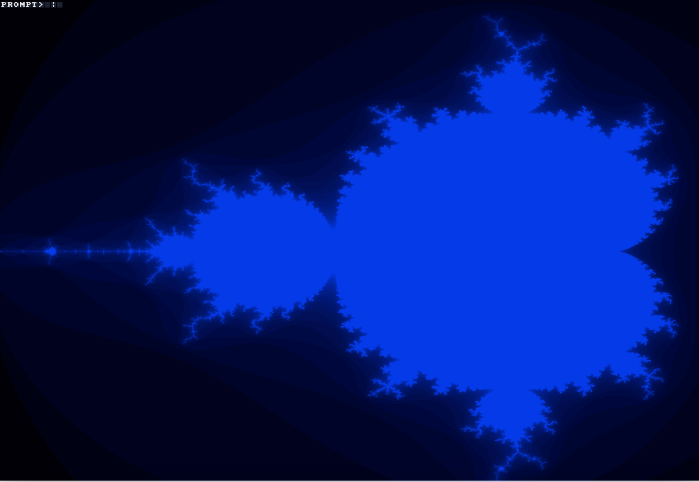
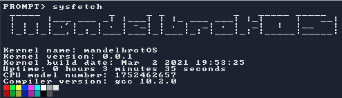
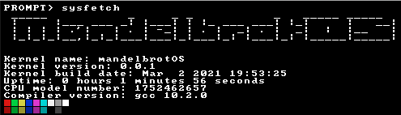
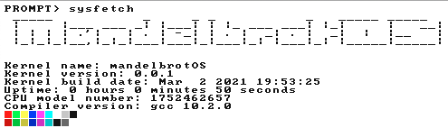
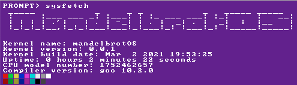

# Welcome
Welcom to the mandelbrot Operating System. 
 This OS is built by a humble group of teenagers over at [Discord](https://discord.gg/W523cD3Q3P). 
 We do this solely to have fun and to learn. 
 We are not organized and are here to enjoy ourselves. 
 Sounds apealling? Create a pull request. We'll see if we can accomodate you.
 

# About 
This project is made for fun and learning
 It's like tracing OS history, but with modern knowledge and not a lot of budget lol

# Where are we in the project
### In that section, I will compare our OS to other OSes from the past
### We are not saying that our OS is equal to them, we are way less talented than those guys were
 We have a shell, with some command.
 We are developping the Unix / MS-DOS of Mandelbrot.
 
 We need a Filesystem. We are planning to use USTAR.

# Running
You'll need to have a cross-compiler, build one using `./build-cross-compiler.sh`.
 Run `make qemu` to compile the OS and run it in `qemu` (needs `qemu-system-i386`) or just `make` to compile it.
 Option are available to build
 To build with azerty keyboard, add AZERTY=1 to the command (`make AZERTY=1 qemu` for exemple).
 To build with clang instead of GCC, add LLVM=1 to the command (`make LLVM=1 qemu` for exemple).

# Using
Using our OS is really simple, on boot, you'll be greated with a shell
 A small variety of command available:
 &nbsp;&nbsp;&nbsp;&nbsp;&nbsp;&nbsp;-cls : clear the screen
 &nbsp;&nbsp;&nbsp;&nbsp;&nbsp;&nbsp;-hello : print hello world
 &nbsp;&nbsp;&nbsp;&nbsp;&nbsp;&nbsp;-hi : print 20 time hi
 &nbsp;&nbsp;&nbsp;&nbsp;&nbsp;&nbsp;-echo : repeat the args if any
 &nbsp;&nbsp;&nbsp;&nbsp;&nbsp;&nbsp;-sysfetch : neofetch but it's in the kernel
 &nbsp;&nbsp;&nbsp;&nbsp;&nbsp;&nbsp;-reboot : reboot the system
 &nbsp;&nbsp;&nbsp;&nbsp;&nbsp;&nbsp;-bsod : kernel panic the system
 &nbsp;&nbsp;&nbsp;&nbsp;&nbsp;&nbsp;-mandlebros : show mandlebros background
 &nbsp;&nbsp;&nbsp;&nbsp;&nbsp;&nbsp;-ctheme : change the theme with the following
 &nbsp;&nbsp;&nbsp;&nbsp;&nbsp;&nbsp;&nbsp;&nbsp;&nbsp;&nbsp;&nbsp;&nbsp;legacy : 
 &nbsp;&nbsp;&nbsp;&nbsp;&nbsp;&nbsp;&nbsp;&nbsp;&nbsp;&nbsp;&nbsp;&nbsp;
 &nbsp;&nbsp;&nbsp;&nbsp;&nbsp;&nbsp;&nbsp;&nbsp;&nbsp;&nbsp;&nbsp;&nbsp;dark : 
 &nbsp;&nbsp;&nbsp;&nbsp;&nbsp;&nbsp;&nbsp;&nbsp;&nbsp;&nbsp;&nbsp;&nbsp;
 &nbsp;&nbsp;&nbsp;&nbsp;&nbsp;&nbsp;&nbsp;&nbsp;&nbsp;&nbsp;&nbsp;&nbsp;light : 
 &nbsp;&nbsp;&nbsp;&nbsp;&nbsp;&nbsp;&nbsp;&nbsp;&nbsp;&nbsp;&nbsp;&nbsp;
 &nbsp;&nbsp;&nbsp;&nbsp;&nbsp;&nbsp;&nbsp;&nbsp;&nbsp;&nbsp;&nbsp;&nbsp;witchcraft : 
 &nbsp;&nbsp;&nbsp;&nbsp;&nbsp;&nbsp;&nbsp;&nbsp;&nbsp;&nbsp;&nbsp;&nbsp;

## Using code
This is open source. Reuse code. Just follow the license terms and we are good. :)
